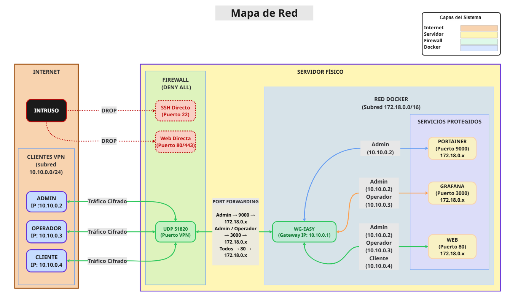

# SecureNet
Secure VPN infrastructure with WireGuard, Docker, Grafana/Loki monitoring and Linux perimeter security

## Overview

SecureNet is a cybersecurity and systems administration project focused on deploying a secure VPN infrastructure with perimeter protection, monitoring, logging and automated auditing.

The project was developed during professional training practices by a team of 4 ASIR students.

## Objectives

- Deploy a secure WireGuard VPN server
- Implement perimeter protection using iptables
- Monitor services and logs with Grafana and Loki
- Automate security auditing and alerts
- Minimize external attack surface
- Validate security using Wireshark and Nmap

## Technologies Used

- Linux
- WireGuard
- Docker & Docker Compose
- iptables
- Fail2Ban
- Grafana
- Loki
- Promtail
- Wireshark
- Nmap
- Bash scripting
- Telegram Bot API

## Architecture

### Network Diagram

## Features

- Secure VPN deployment with WireGuard
- Firewall hardening using iptables
- SSH protection with Fail2Ban
- Centralized log monitoring
- Grafana dashboards
- Telegram alert system
- Automated auditing scripts
- Log rotation and retention policies
- External exposure validation using Nmap

## Security Measures

- Minimal exposed services
- VPN-only access policy
- Closed SSH and HTTP external access
- Packet filtering with iptables
- Brute-force mitigation using Fail2Ban
- Continuous monitoring and alerting
- Traffic inspection using Wireshark

## Troubleshooting & Problem Solving

One of the biggest technical challenges during deployment involved communication issues between Grafana, Loki and Docker networking.

After extensive debugging, testing Docker networking behavior, firewall rules and IPv4/IPv6 forwarding, the issue was solved by adjusting kernel networking parameters and packet forwarding behavior.

Relevant system configurations included:

- net.ipv4.ip_forward=1
- net.bridge.bridge-nf-call-iptables=1

This troubleshooting process required extensive testing, log analysis and infrastructure debugging.

## Security Validation

### External Nmap Scan

- Only WireGuard UDP port exposed
- SSH and HTTP inaccessible externally

### Wireshark Analysis

- Verified encrypted WireGuard traffic
- Confirmed blocked unauthorized access

## Project Status

Completed as part of ASIR professional practices.

Repository sanitized for public portfolio purposes.
Sensitive information, credentials and infrastructure secrets have been removed or anonymized.
